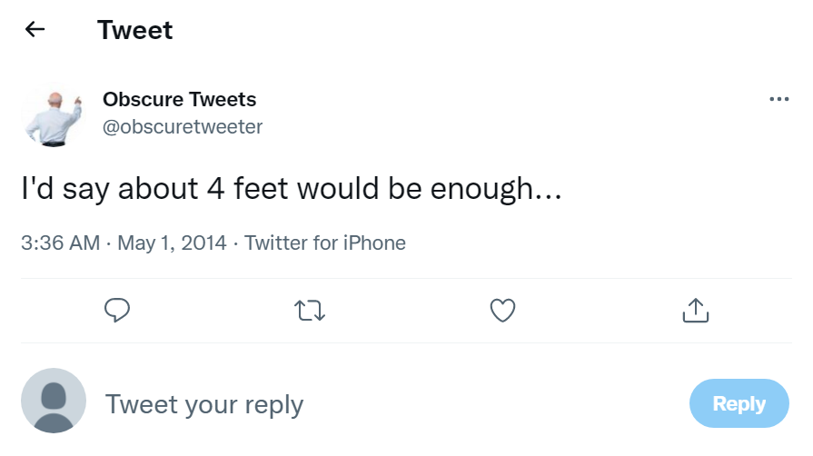
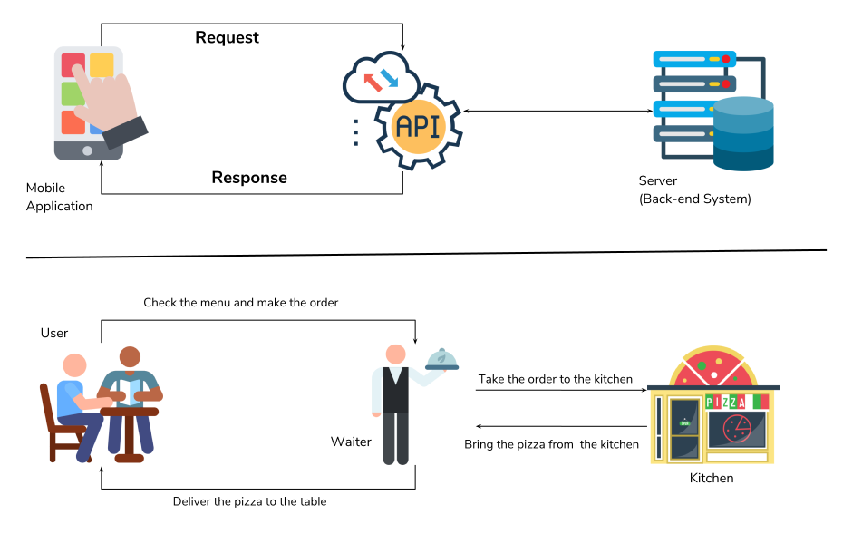

# Learning to Speak Twitter

Twitter is a social media platform where users post short messages, pictures, news stories, and other content to be viewed by others. These postings are referred to as "tweets". Twitter users curate their social media by subscribing to (or following) other twitter accounts. It allows people from all over the world to interact with each other almost instantaneously.

If you've never used Twitter before, the terms used there can be cryptic (and NSFW). Beyond "@ing people" and "hashtags", the users themselves have created Twitter-wide standards. Twitter is also filled with subcommunities who use their own lingo.

Twitter has its own <a href="https://help.twitter.com/en/resources/twitter-guide/twitter-101/speak-the-language-of-twitter-twitter-help">getting started guide.</a> 
But here are a few you will hear throughout the workshop and might see as fields in your data.  

| Twit-term | Definition |
|-----------|------------|
| Tweet     | Can be a noun or a verb. Tweets are messages posted to twitter that are make to be shared and interacted with |
| Hashtag   | A keyword or phrase (no spaces) with the `#` before it. You can use hashtags to see other tweets with the same tag |
| Retweet   | A shared tweet |
| @-        | Usernames begin with a `@` symbol and are used as a unique identifier for a twitter profile. |
| Following | subscribing to a twitter account. You can see an account's tweets as soon as they post something new|
| Mention   | By including the @ sign followed by a username, you can mention other accounts. This refers to usernames included in a tweet |
| Verified  | a verified Twitter account receives a blue check icon to indicate that the creator of these tweets is a legitimate source, such as a public figure |
     | 

### Tweet

This is an example of what a tweet looks like on the brower.

> ## Your Twitter Experience
> If you are a twitter user, what terms have you encountered in your use?
> Alternatively, what do you know from Twitter as a non-twitter user?
{: .challenge}

This is a not too awful guide:
https://www.lifewire.com/twitter-slang-and-key-terms-explained-2655399



# Why Should You Care About Twitter?

Every user, tweet, video, and emoji on Twitter is data that can be collected and analyzed. In recent years Twitter analysis has become increasingly popular and has played a hand in predicting events, from natural disasters to Election outcomes.

With millions of tweets sent out each day, and the range of content within those tweets means that Twitter is a source for a large amount of data.

> ## Big Data
>  Based on these guidelines, some refer to Twitter data as Big Data. Big Data as been distinguished as so much data that it is unmanageable, and therefore unable
>  to be analyzed. We won't be handling Big Data during this lesson. 
{: .callout}

In order to analyze Twitter data, we must first retrieve it which we will be doing using a tool called an API.

# API: A Complicated Topic and a (mostly) Easy Tool

API is an abbreviation that stands or Application Programming Interface. It allows computers or applications to communicate with one another without requiring users to code operations from scratch. APIs allow you to use abstraction, because similar to how you don't need to know the engineering behind your shower in order to use it, you don't need to understand the code behind APIs in order to fetch data.

Formally defined, an API is a set of commands, functions, protocols, and objects used by programmers to create software or to interact with external system.

## Common Analogy

Imagine yourself sitting at a table in a restaurant. The waiter comes to your table and you may choose from a set list of items on the menu. The waiter then takes your order to the cooks who put together different meals and drinks for your table. The waiter then takes your order to your table.

Here are the key players in our analogy:
1. Customer - you as the user
2. Menu items - the commands and operations you can pass to an API in order to retrieve information
3. Waiter - the API that delivers your information request to the system, and then your resulting dataset to you
4. Cooks - the external program or webserver that has the information you seek

You can see a visualize of this analogy <a href="https://www.mulesoft.com/resources/api/what-is-an-api">in this video</a>.

> ## APIs are not Webscraping
> The biggest difference between APIs and Webscraping is the retrieval method. With **APIs** you are using a system preset by the website you are trying to access the data from (Twitter, YouTube, Spotify, etc.). 
> There are often requirements about what you can and cannot retrieve from the site and what you can do once you have the data, but it is generally very efficient and doesn't require too much from the user. 
> **Webscraping** is a tool used to extract specific information from a website(s). 
> Typically, webscraping is best for extracting data from multiple sites at once, when there is no API available, or when the amount of data you want to extract exceeds the limits you're given.
> If you're interested in learning more about webscraping, you can check out our ['Introduction to Webscraping'](https://ucsbcarpentry.github.io/2022-05-12-ucsb-webscraping/01-introduction/) workshop. 
{: .callout}

# twarcing

You may be asking, "What is twarc?" or, "Why do all things involving Twitter have to start with a 'tw'?".

twarc is a command line tool and Python library that is used to collect and archive Tweets through the Twitter API. The great thing about twarc is that it's accessible, free, and fairly easy to use once you get the hang of it. It's also an active open-source project (that means it is essentially open to collaboration and use by anyone) and is well-documented on [Github](https://twarc-project.readthedocs.io/en/latest/) by an organization referred to as [Documenting the Now](https://www.docnow.io/). 

> ## Issues
> If you run into any errors, the people who built twarc respond quite quickly (and they're very friendly). 
> Navigate to the ['Issues'](https://github.com/DocNow/twarc/issues) page on their repository and open a new issue. You also view pre-existing issues (open or closed) to see if someone has already answered a question like yours.
{: .callout}

Twarc allows you to request specific data based on keywords, hashtags, events, and other areas of interest. Once you have your dataset, twarc has what the developers refer to as 'utilities'. These as python programs that can be run on the command line to explore and visualize your data. An is is the utility 'wordcloud.py' which creates a wordcloud of the text from the tweets you've collected. We'll see these capabilities put into practice in later episodes. 

