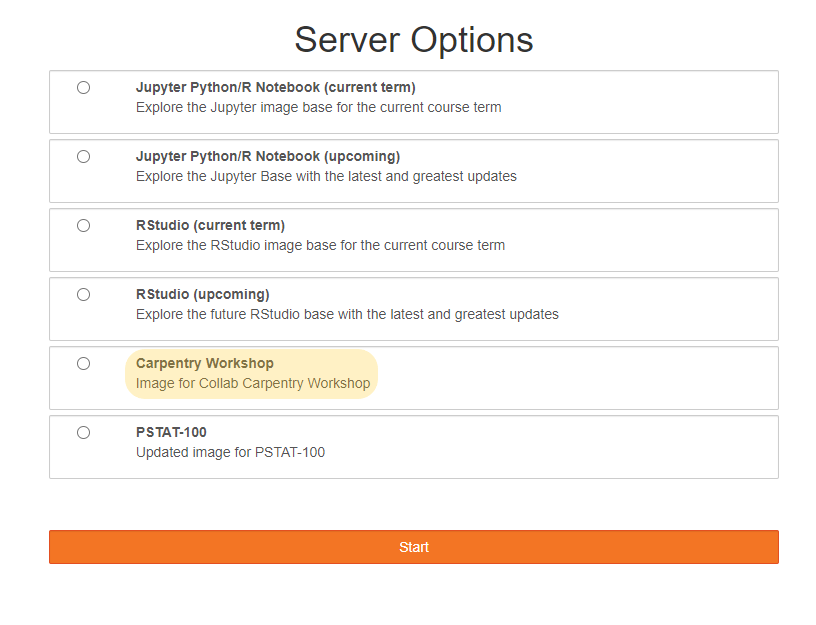

# Brief Intro to JupyterLab

JupyterLab is a web interface for creating Python scripts with Jupyter Notebooks. For
this workshop, we will be using a hosted instance of JupyterLab pre-configured with
all of the Python tools you will need to follow along with the lesson.

JupyterLab is an
integrated development environment (IDE) that enables us to write and run programs.
JupyterLab runs in one tab on your browser. In this episode, we will learn to
upload and download files from your computer to your storage space on JupyterLab,
create and navigate the directory structure, and use the built-in BASH terminal.

> ## Thanks
>
> For this workshop, we will be using JupyterLab with twarc already loaded in. The reason
> we are able to use JupyterLab without needing to download any software is because our
> JupyterLab server is hosted by UCSB Letters & Sciences IT. Thank you to Letters &
> Sciences IT for setting up our JupyterLab server :)
{: .callout}

If you have a fully configured version of Python, you can also install and run twarc on
your own computer. The documentation for installing Twarc is found at [this
repository](https://scholarslab.github.io/learn-twarc/06-twarc-command-basics.html). For
this workshop, follow along in the provided environment.

## Starting up JupyterLab
Open our [LSIT JupyterLab](https://test.lsit.ucsb.edu/) in a fresh web browser window.

Select 'Carpentry Workshop' under the server options. It will take a few minutes to fire up your virtual machines.

## Navigating the JuptyerLab interface

When you first open JupyterLab, you will find a file browser tab on the far left side of
the screen. This is where we can manage our files and navigate in-and-out of directories. The window that
is labeled "Launcher" contains options for what to start up. For this workshop, we will
be using Python 3 Notebook and Terminal.

Next, note the toolbar found at the top on the screen.
There, you will find options that are needed
to run and save programs you write.

To start off, we need to create some directories that we will be working in. Open the file
browser and create a folder to store all of your workshop files in (e.g. data, python notebooks). To create a folder, select
the icon that is highlighted in the above image. We have chosen to name the folder
`twarc-run`. <strong>We will organize all of our work in this folder, and this folder will be our home directory.</strong>

Inside of `twarc-run`, let's make two more folders. Please create one folder that is 
named `source-data`, and create a second folder named `output-data`. Source-data is 
where we will store twitter data we collect during the workshop. The output-data folder 
for is where we will store twitter data we process. `output-data` should not be inside 
of `source-data`, and vice versa. Instead, both folders should be inside of `twarc-run`.

Since `source-data` is where we will store our original data files, please open this data folder
and upload all of the datafiles:

- `taxday.jsonl` tweets from American tax day, 2022
- `one_tweet.jsonl` a single tweet to look at
- (FIXME)

And create another folder to contain all the `.py` files that are inside of
`utils.zip`.
- don't upload the zip file. Unzip it and upload the individual `.py` files.

If you have not downloaded the data, please
do so now from the [Setup Page](https://ucsbcarpentry.github.io/twitter-with-twarc/setup.html)
instructions. Once the data files are uploaded, navigate back to your up to our project
directory `twarc-run`. Once you are done, your file organization should look like the
below image.

Now, let's start up the terminal. In your Launcher tab, select the Terminal icon under
"Other". We will be using the terminal to sign into your twitter developer account. You
will see that the launcher screen is replaced by the terminal window. You may open the
launcher tab by selecting the large rectangular button with the plus (+) sign. When you
open the launcher in this way, the terminal window will not close.

The terminal window is all about the keyboard--you cannot mouse around in there. The terminal
window is running a lightweight verion of BASH, so you can use all of the common Linux/Unix
file system commands such as:

- `pwd`
- `cd`
- `ls`

Let's move around our directories in the Terminal to get comfortable.

Print your working directory and make sure you are in the directory `twarc-run`. If you 
are not in the proper directory, please change directories to move inside `twarc-run`. Moving
around in your directories is pretty easy using this interface.

Needed data file: a single tweet
`cat` out the file. 
use python viewer
nano the file

> ## Remember:
>
> You can only type where the cursor is blinking. And you can't move the cursor
> with your mouse.
>
{: .callout}

# Configuring twarc in the Terminal

Continuing in the terminal window, we will configure Twarc so that it is connected to your Twitter
developer account and to your app. If you do not have a twitter developer account, please
complete the [Setup Page](https://ucsbcarpentry.github.io/twitter-with-twarc/setup.html)
instructions. Please take a moment to gather the following keys and tokens:

> ## Tokens and Keys
>
>- Bearer Token
>- API Key
>- API Key Secret
>- Access Token
>- Access Token Secret
>
{: .checklist}

Let's start
configuring twarc by sending typing in `twarc2 configure`. You should get the output below:

~~~
twarc2 configure
~~~
{: .language-bash}

~~~
👋 Hi I don't see a configuration file yet, so let's make one.

Please follow these steps:

1. visit https://developer.twitter.com/en/portal/
2. create a project and an app
3. go to your Keys and Tokens and generate your Keys

Please enter your Bearer Token (leave blank to skip to API key configuration):
~~~
{: .output}

We will be entering in all of our keys and tokens and should not have to leave any of the
prompts blank. You may copy/ paste the keys and tokens you were asked to save. At this
step, please enter your bearer token.

> ## Copy and Paste keyboard shortcuts
>
> Windows and Linux:
> `ctrl + c` to copy, `ctrl + v` to paste
>
> Mac:
> `command + c` to copy, `command + v` to paste
>
{: .callout}

~~~
Please enter your Bearer Token (leave blank to skip to API key configuration): xxxxxxxxxxxxxxxxxxxxxxxxx
(Optional) Add API keys and secrets for user mode authentication [y or no]?
~~~
{: .output}

After you enter your bearer token, please enter `y` for the following question. This is so we can add the API key and API secret.

~~~
(Optional) Add API keys and secrets for user mode authentication [y or no]? y
Please enter your API key: xxxxxxxxxxxxxxxxxxxxxxxxx
Please enter your API secret: xxxxxxxxxxxxxxxxxxxxxxxxx
How would you like twarc to obtain your user keys?
~~~
{: .output}

At this step, please select the option to manually input your user keys.

~~~
Please enter your choice [1 or 2] 2
Enter your Access Token: xxxxxxxxxxxxxxxxxxxxxxxxx
Enter your Access Token Secret: xxxxxxxxxxxxxxxxxxxxxxxxx
~~~
{: .output}

After you have entered your Access Token Secret, you will see the following message.

~~~
Your keys have been written to /home/xxxx/.config/twarc-run/config

✨ ✨ ✨  Happy twarcing! ✨ ✨ ✨
~~~
{: .output}

All of the information you just entered is saved in a configuration file. Next time you
start up twarc on this JupyterLab, you will not need to configure twarc.

If you try to run a twarc command without configuring twarc, you may see this message:

~~~
Incomplete credentials provided.

Please run the command "twarc2 configure" to get started.
~~~
{: .output}

# Test our Twarc configuration from the Notebook

We should confirm that Twarc was configured correctly and that you are ready to continue
using Twarc. To test the Twarc configuration, we will harvest tweets from a twitter
account. At the same time, we will learn how to send Python commands from a Jupyter
Notebook.

Please Open a new launcher (select the blue rectangular button with the 
plus sign) and open a Python 3 Notebook (do not open a Python 3 
Console). You will see the following window open:

At the top of the Notebook tab, notice that there is a new toolbar. Each of the buttons
has a shortcut key. We will mostly use `b` to add a cell, `ctrl` + `enter` to execute
whatever code is inside the current cell.

You can type either Python code or Markdown into a cell. We will be doing both.
We are using this notebook so that we can save our work along the way. At the end of the day,
you can save your notebook file and try to run it later on your own installation of twarc.

Let's put some effort into formatting it nicely by putting Markdown
at the top: 

`# Twitter with twarc Workshop notebook` 

`This notebook contains all of the code used to harvest and analyze Tweets` 

If you run that line, Jupyter will render that markdown into something that looks
like this:

### (insert screenshot)

Now, let's call twarc2 from inside of our notebook

> ## BASH Commands in JupyterLab
>
> We can run Twarc from the terminal window in JupyterLab, or we can send
> BASH commands from our Jupyter Notebook.
>
> Because we will be using a mix of Python code and BASH commands, it's important
> to keep in mind which is which. 
> When we use JupyterLab to run BASH commands, we need to start each line with an
> exclamation point (! often pronounced "bang" by nerds). For example: if a Twarc command is
> `twarc2 search`, then the line to run the twarc command in JupyterLab
> is:
>
> ~~~
> !twarc2 search
> ~~~
> {: .language-bash}
>
{: .callout}

The twitter account that we will collect tweets from is Bergis Jules, an archivist and 
scholar working in digital humanities. He is the Community Lead for [Documenting the Now 
(DocNow)](https://www.docnow.io/), the project behind Twarc's development. To retrieve 
Jules' recent tweets, please run the following command in a Python Notebook:

~~~
!twarc2 timeline BergisJules > 'source-data/bjules.jsonl'
~~~
{: .language-python}

If the
twarc configuration was successful, you will see a loading bar at the
bottom of the cell.

After the cell has completed running the line, there
will be a file called "bjules.jsonl" inside of `source-data` on your file browser. This file
contains the data of tweets under the username "@BergisJules".

> ## Challenges
>
> * Can you find the file called "bjules.jsonl"?
> * Download a timeline for one of the twitter accounts from this list:
> NCEAS "@ucsb_nceas", EcoDataScience "@ecodatasci", R-Ladies Santa Barbara "@RLadiesSB",
> spatial@ucsb "@spatialUCSB", UCSB Collaboratory "@libratorybot"
>
> * What do you notice about the file that was created from using the timeline command?
>
{: .challenge}

## Twarc: twitter and archiving

> ## [Documenting the Now](https://www.docnow.io/)
>
> "Documenting the Now develops open source tools and community-centered practices that support the ethical collection, use, and
> preservation of publicly available content shared on web and social media. Documenting the Now responds to the public's use of social
> media for chronicling historically significant events as well as demand from scholars, students, and archivists, among others, seeking a
> user-friendly means of collecting and preserving this type of digital content."
{: .callout}

The Documenting the Now Project started in 2014, during the aftermath of the killing of Michael Brown Jr. in St. Louis, Missouri (U.S.).
A group of archivists got together, recognizing that protest and activism surrounding this had initially happened on twitter and other social media.
There was also a consideration of how this content would be recorded as a part of history, starting with this idea of how these events would be remembered as they transpired on social media.
Bergis Jules and Ed Summers collected tweets that contained the key word 'ferguson' (the suburb of St. Louis where Brown was killed), collecting 13 million tweets.
In the process of doing so, they developed a utility named twarc, short for twitter and archiving.

A large part to DocNow is commitment to ethical social media collection.
Activists and protesters had not consented to be part of an archive, with their content that were on twitter and other places online.
They were never consulted on if they wanted their content to be remembered long from now.
A large part of the DocNow was how to build an archive of social media content for the long term, with consent from the content creators.
For us in the workshop, we will be discussing practices for ethical twitter harvesting before going over instruction on using twarc.

## Using the Help

By using the --help command, you can pull up the syntax guidance and available tools with
twarc. You may find this useful as you go through the lessons to learn how to use
different tools, or at the end of the workshop as a summary of the tools you have
learned. Let's run it from our notebook so that we can view it at our convenience.

twarc2 is a program, not a line of code, so we start the line with an exclamation point `!`.

~~~
!twarc2 --help
~~~
{: .language-python}

~~~
Usage: twarc2 [OPTIONS] COMMAND [ARGS]...

  Collect data from the Twitter V2 API.

Options:
  --consumer-key TEXT         Twitter app consumer key (aka "App Key")
  ...
  --help                      Show this message and exit.

Commands:
  compliance-job  Create, retrieve and list batch compliance jobs for...
  configure       Set up your Twitter app keys.
  conversation    Retrieve a conversation thread using the tweet id.
  conversations   Fetch the full conversation threads that the input...
  counts          Return counts of tweets matching a query.
  dehydrate       Extract tweet or user IDs from a dataset.
  flatten         "Flatten" tweets, or move expansions inline with tweet...
  followers       Get the followers for a given user.
  following       Get the users that a given user is following.
  hydrate         Hydrate tweet ids.
  liked-tweets    Get the tweets liked by a specific user_id.
  liking-users    Get the users that liked a specific tweet.
  lists           Lists API support.
  mentions        Retrieve max of 800 of the most recent tweets...
  places          Search for places by place name, geo coordinates or ip...
  quotes          Get the tweets that quote tweet the given tweet.
  retweeted-by    Get the users that retweeted a specific tweet.
  sample          Fetch tweets from the sample stream.
  search          Search for tweets.
  searches        Execute each search in the input file, one at a time.
  stream          Fetch tweets from the live stream.
  stream-rules    List, add and delete rules for your stream.
  timeline        Retrieve recent tweets for the given user.
  timelines       Fetch the timelines of every user in an input source of...
  tweet           Look up a tweet using its tweet id or URL.
  user            Get the profile data for a single user by either...
  users           Get data for user ids or usernames.
  version         Return the version of twarc that is installed.
~~~
{: .output}

These are all of the commands that you can send via twarc2. You can also view all the
help for twarc 1.0!

## Writing Python code in your Notebook
So far we have sent BASH commands and typed Markdown in our Notebooks. But the 
main reason to use Jupyter Notebooks is to write code. Let's load the Python libraries
we will be using today, and then load our Tax Day data into a Pandas dataframe:

`import pandas`

`import twarc_csv`

Because these are python commands, no need to !bang! But you might need
to `pip install twarc_csv`

We will almost always convert our files to .csv format, so we may as well
start doing that now.

*** convert to csv and then dataframe goes here. ***
This will be our introduction to writing Python in notebooks.
Will reinforce running lines, clearing output. 

Twitter Timelines, and other files we harvest using twarc, needs to be 
'flattened' before we use it. This will ensure that each line of jsonl
is one tweet:

!twarc2 flatten raw_data/bjules.jsonl output_data/bjules_flattened.jsonl

csv's are even conventient for reading, and are useful as a data format
later on for analyzing tweets outside of twarc. 

# convert
!twarc2 csv raw_data/bjules.jsonl output_data/bjules.csv

We will also get in the habit of making dataframes 
out of our csv's, because they are the main tool for 
manipulating data in Pandas. 

Now that we have flatenned our data and made a csv, we can see how
many tweets we harvested from Jules's timeline using `wc`.

We can cut this down to just 
loading the libraries if we this this is too long. CSV is currently in 
episode 4, but you CAN do it here.


