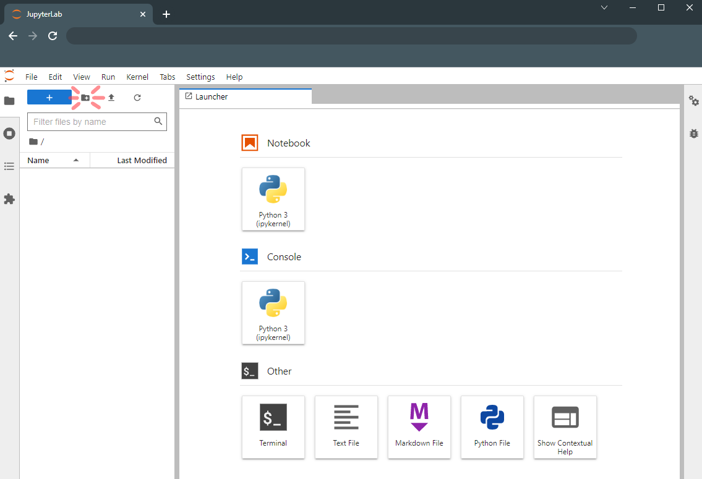
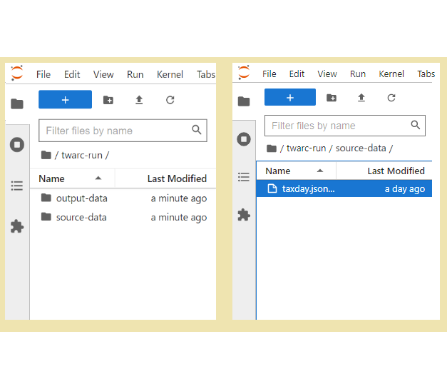
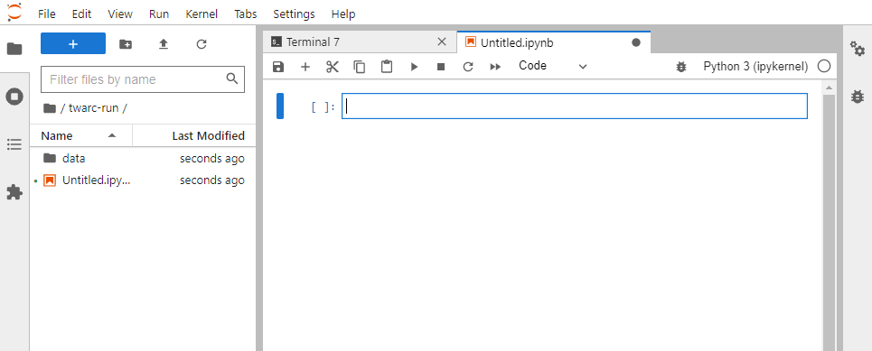

# Brief Intro to JupyterLab

If this is not the first time you are using JupyterLab, then note that we will be using an instance of Jupyterlab that is not locally hosted.
For new users, JupyterLab is an integrated development environment (IDE) that enables us to write and run programs. JupyterLab runs in one tab on your browser, and you will eventually find that you can also navigate files and open other windows on the JupyterLab page.

> ## Thanks
>
> For this workshop, we will be using JupyterLab with twarc already loaded in.
> The reason we are able to use JupyterLab without needing to download any software is because our
> JupyterLab server is hosted by UCSB Letters & Sciences IT.
> Thank you to Letters & Sciences IT for setting up our JupyterLab server :)
{: .callout}

Outside of the workshop, you may use your local Python to use Twarc. The documentation for installing Twarc is found at [this repository](https://scholarslab.github.io/learn-twarc/06-twarc-command-basics.html).

# Navigating the JuptyerLab interface

When you first open JupyterLab, you will find a file browser tab on the far left side of the screen. This is where we can manage our files and navigate directories. The tab that is labeled "Launcher" contains options for what to start up. For this workshop, we will be using Python 3 Notebook and Terminal. The last JupyterLab interface thing to note is the toolbar found at the top on the screen. There, you will find options that are needed to run and save programs you write.

To start off, we need to create the directory that we will be working in. Open the file browser and create a folder to store your workshop files in. To create a folder, select the icon that is highlighted in the above image. We have chosen to name the folder "twarc-run" in the example images. This folder will be your working directory. Next, open your working directory (you may do this by selecting the folder) and create another folder called "data". This folder is where you will be storing your data files. Please open the data folder and upload the `taxday.jsonl` data file. If you have not downloaded the data, please complete the [Setup Page](https://ucsbcarpentry.github.io/twitter-with-twarc/setup.html) instructions. Once the data file is uploaded, navigate back to your working directory (exit the data folder). Once you are done, your file organization should look like the below image.

Now, let's start up the terminal. In your Launcher tab, select the Terminal icon under "Other". We will be using the terminal to sign into your twitter developer account. You will see that the launcher screen is replaced by the terminal window. You may open the launcher tab by selecting the large rectangular button with the plus (+) sign. When you open the launcher in this way, the terminal window will not close.

# Configuring Twarc

In the terminal window, we will configure Twarc so that it is connected to your Twitter developer account and to your app. If you do not have a twitter developer account, please complete the [Setup Page](https://ucsbcarpentry.github.io/twitter-with-twarc/setup.html) instructions. Please take a moment to gather the following keys and tokens:

- Bearer Token
- API Key
- API Key Secret
- Access Token
- Access Token Secret

~~~
twarc2 configure
~~~
{: .language-bash}

~~~
👋 Hi I don't see a configuration file yet, so let's make one.

Please follow these steps:

1. visit https://developer.twitter.com/en/portal/
2. create a project and an app
3. go to your Keys and Tokens and generate your Keys

Please enter your Bearer Token (leave blank to skip to API key configuration):
~~~
{: .output}

We will be entering in all of our keys and tokens and should not have to leave any of the prompts blank. You may copy/ paste the keys and tokens you were asked to save. At this step, please enter your bearer token.

> ## Copy and Paste keyboard shortcuts
>
> Windows and Linux:
> `ctrl + c` to copy, `ctrl + v` to paste
>
> Mac:
> `command + c` to copy, `command + v` to paste
>
{: .callout}

~~~
Please enter your Bearer Token (leave blank to skip to API key configuration): xxxxxxxxxxxxxxxxxxxxxxxxx
(Optional) Add API keys and secrets for user mode authentication [y or no]?
~~~
{: .output}

After you enter your bearer token, please enter `y` for the following question. This is so we can add the API key and API secret.

~~~
(Optional) Add API keys and secrets for user mode authentication [y or no]? y
Please enter your API key: xxxxxxxxxxxxxxxxxxxxxxxxx
Please enter your API secret: xxxxxxxxxxxxxxxxxxxxxxxxx
How would you like twarc to obtain your user keys?
~~~
{: .output}

At this step, please select the option to manually input your user keys.

~~~
Please enter your choice [1 or 2] 2
Enter your Access Token: xxxxxxxxxxxxxxxxxxxxxxxxx
Enter your Access Token Secret: xxxxxxxxxxxxxxxxxxxxxxxxx
~~~
{: .output}

After you have entered your Access Token Secret, you will see the following message.

~~~
Your keys have been written to /home/xxxx/.config/twarc/config

✨ ✨ ✨  Happy twarcing! ✨ ✨ ✨
~~~
{: .output}

After inputting the keys and tokens, a file is made of your configuration. Next time you start up twarc on this JupyterLab, you will not need to configure twarc.

If you try to run a twarc command without configuring twarc, you may see this message:

~~~
Incomplete credentials provided.

Please run the command "twarc2 configure" to get started.
~~~
{: .output}

# Test for Twarc configuration

We should confirm that Twarc was configured correctly and that you are good to continue using Twarc. To test the Twarc configuration, we will harvest tweets from a twitter account. Please Open a new launcher (select the blue rectangular button with the plus sign) and open a Python 3 Notebook (do not open a Python 3 Console). You will see the following window open:

Notice that there is a separate toolbar for using python notebook.

> ## Twarc Commands in JupyterLab
>
> Twarc tools are ran as bash commands. Since we will be using JupyterLab to run bash commands, we need to add an exclamation point (!) beforehand.
> For example: if a Twarc command is `twarc2 search`, then the line to run the twarc command in JupyterLab is:
>
> ~~~
> !twarc2 search
> ~~~
> {: .language-python}
>
{: .callout}

The twitter account that we will collect tweets from is Bergis Jules, a archivist and scholar working in digital humanities. He is Community Lead for [Documenting the Now (DocNow)](https://www.docnow.io/), the project behind Twarc's development. To retrieve Jules' recent tweets, please run the following command in a Python Notebook:

~~~
!twarc2 timeline BergisJules > bjules.jsonl
~~~
{: .language-python}

It will take a few minutes to fire up your virtual machines. If the twarc configuration was successful, you will see a loading bar at the bottom of the cell. After the cell has completed running the line, there will be a file called "bjules.jsonl" in your file browser. This file contains the data of tweets under the username "BergisJules".

> ## Challenges
>
> How many tweets did you get from Bergis?
> Can you find the file called "bjules.jsonl"?
> Download a timeline for a person of your choice. How many tweets did you get? What’s the oldest one?
>
{: .challenge}

## Reading the Help

## A little bit more about where twarc came from


