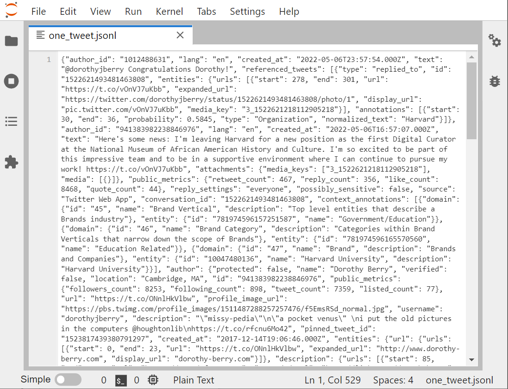
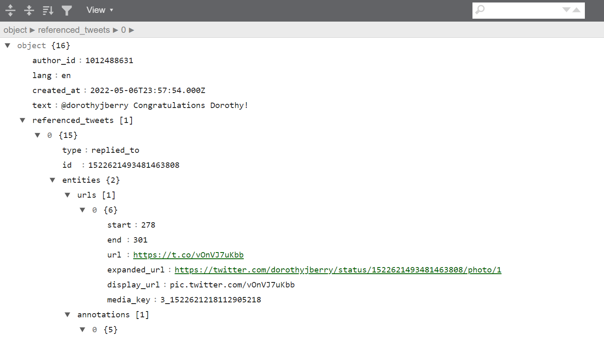
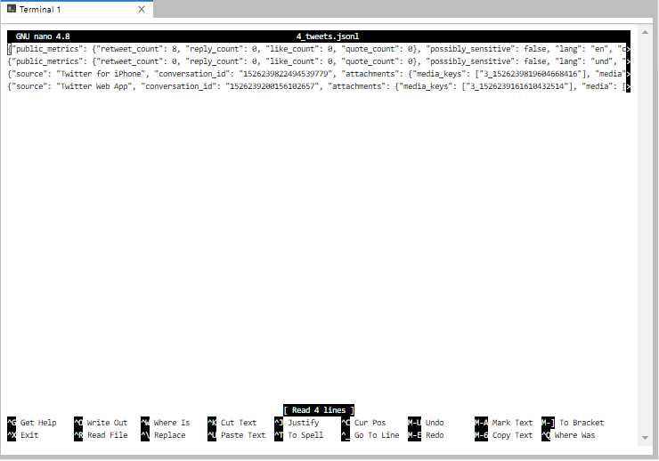

# Examining a twarc JSON file

JSONL, Line-oriented JavaScript Object Notation, is frequently used as a
data interchange format. It has become super common in the data science
field, and you will encounter it frequently. 

Let's look at one individual tweet file, in the Jupyter viewer.

The Jupyter viewer has numbering, so we can see that this whole screen
is one line. Looking at the beginning of the file, is it obvious that JSON is a
whole bunch of named-value pairs? ie:

~~~
"name": "Joe Gaucho",
"address": "123 Del Playa",
"age": 23,
"email": "jgaucho@ucsb.edu",
~~~
{: .output}

You can see that the key is in quotes, then there's a
colon, then the value. If the value is text, that's going to be in quotes too.

Both nano and the Jupyter editor allows us to format the text with
returns and indents, so that the individual named-value pairs are easier to identify.

Just to show you the the contents of a single tweet, look to the output below. The 
output is an edit of the data with only white-space characters. These edits have been 
made to explore and separate the tweet's content from the metadata.

We can see that it is the 4th piece of data in the tweet is "text", and is
after the author's ID, the language, and time stamp. The fifth
element, "referenced tweet", tells us that this tweet is in reply to another tweet.

~~~
{"data": [{"author_id": "1012488631",
"lang": "en",
"created_at": "2022-05-06T23:57:54.00Z",
"text": "@dorothyjberry Congratulations Dorothy!",
"referenced_tweets": [{"type": "replied_to",
                       "id": "1522621493481463808"}],
"entities":
    {"mentions":
        [{"start": 0,
          "end": 14,
          "username": "dorothyjberry",
          "id" : "941383982238846976"}],
     "annotations": [{"start": 31, "end": 37,
          "probability": 0.8784,
          "type": "Person", "normalized_text": "Dorothy"}]},
     "in_reply_to_user_id": "941383982238846976"
     "public_metrics": {"retweet_count": 0,
           "reply_count": 0,
           "like_count": 1,
           "quote_count": 0},
reply_settings": "everyone",
"possible_sensitive": false,
"id": "1522727385380143105",
"source": "Twitter Web App",
"conversation_id": "1522621493481463808"},
~~~
{: .output}

There are many, many elements attached to each Tweet. You will probably never use
most of them.

Some key pieces of a Tweet are:
- created_at: the exact day and time (in GMT) the tweet was posted
- id: a unique tweet ID number
- entities: strings pulled out of a tweet that line up with something
  - any hashtags that are used
  - any users who are @'ed
  - personal names
- referenced_tweets.retweeted.id' if this is a retweet, this field shows the id of 
  the original tweet.

- user
  - id
  - name
  - screen name (twitter handle)
  - followers_count (at the time the tweet was created)

All of these elements become much more visible if we download our tweet
and open it up with [an online JSONL viewer](https://codebeautify.org/jsonviewer)

We can also see just the name of each field by using the columns
method on any dataframe we have made from Twitter data. For example,
 ecodatasci_df, the dataframe created from the ecodatasci timeline:

~~~
list(ecodatasci_df.columns)
~~~
{: .language-python}

~~~
['id',
 'conversation_id',
 'referenced_tweets.replied_to.id',
 'referenced_tweets.retweeted.id',
 'referenced_tweets.quoted.id',
 'author_id',
 'in_reply_to_user_id',
 'retweeted_user_id',
...
 '__twarc.retrieved_at',
 '__twarc.url',
 '__twarc.version',
 'Unnamed: 73']
~~~
{: .output}

This gives you a sense of just how much data comes along with a tweet.

## First and last tweets
Let's look at our `gasprices_flat.jsonl` file again.

Remember our JSONL files are line-oriented, ie: one tweet per line. Let's use the
`head` and `tail` command to create files with two tweets each. Better yet, one
file with all 4.

The double-greater-than `>>` appends rather than creates. 

~~~
!head -n 2 'output_data/bjules_flat.jsonl' > 'output_data/4_tweets.jsonl'
~~~
{: .language-bash}

~~~
!tail -n 2 'output_data/bjules_flat.jsonl' >> 'output_data/4_tweets.jsonl'
~~~
{: .language-bash}

If we use `!cat` to output one of these files, we see a real
mess. Let's open the Jupyter graphical file viewer instead.

> ## Why not use nano?
>
> Nano, which we can call from the shell window, is a great way
> to stay in our little shell window
> with our hands on our keyboards.  However, we are going to spend
> our workshop in Jupyter to make our work more reproducible.
>
> However, sometimes it's going to be advantageous to
> look at a file in nano, because the JSONL files open with lines
> unwrapped.
> our 4-tweets file, for example
> {: .source}
{: .callout}

Using either method, it's still difficult to tell what's going on. Can
we even tell where one tweet ends, and the second begins? Jupyter
does have line numbers, so at least we can see 
it's 4 lines.

In nano, it's very easy to see what order the tweets come in, and therefor, what
the date range of our tweets are:

# A Very Basic Analysis

We can do a few things without even looking at the JSONL
directly. When we harvest tweets, it is a very good idea to do a little exploratory
analysis to make sure you got what you expected. As we did in the previous
episode, let's look at 
the bash command `wc` (word count) to see how many lines of JSONL are in
our gas prices file. We will need to flatten it!

~~~
! twarc2 flatten raw_data/hashtag_gasprices.jsonl output_data/hashtag_gasprices_flat.jsonl
! wc output_data/hashtag_gasprices_flat.jsonl
~~~
{: .language-python}

~~~
15698   7653538 100048736 hashtag_gasprices.jsonl
~~~
{: .output}

We can then look at the timestamps of the first and last tweets to determine
the date range of our tweets by using the `head` and `tail` commands to
get the first line and last line of the file:
~~~
!head -n 1 'output_data/hashtag_gasprices_flat.jsonl'
!tail -n 1 'output_data/hashtag_gasprices_flat.jsonl'
~~~
{: .bash}

Lets save this output into a file named "gasprice_date_range.jsonl":

~~~
!head -n 1 'raw_data/hashtag_gasprices.jsonl' > 'output_data/gasprice_range.jsonl'
!tail -n 1 'raw_data/hashtag_gasprices.jsonl' >> 'output_data/gasprice_range.jsonl'
~~~
{: .bash}

Let’s do this basic analysis for our two other files of raw data: bjules.jsonl and
 ecodatasci.jsonl (or whatever timeline you downloaded).

> ## Challenge: Getting Date Ranges
> Please create the files `bjules_range.jsonl` and `ecodatasci_range.jsonl` that
> contains the first and last tweets of bjules.jsonl and ecodatasci.jsonl.  Use
> one cell per file.
>
> Remember to specify where to store your output files.
>
> > ## Solution
> > ~~~
> > !head -n 1 'raw_data/bjules.jsonl' > 'output_data/bjules_range.jsonl'
> > !tail -n 1 'raw_data/bjules.jsonl' >> 'output_data/bjules_range.jsonl'
> > !wc 'raw_data/bjules.jsonl'
> > ~~~
> > {: .language-python}
> > We can see that we retrieved Bergis' texts back to 2018.
> >
> > ~~~
> > !head -n 1 'raw_data/ecodatasci.jsonl' > 'output_data/ecodatasci_range.jsonl'
> > !tail -n 1 'raw_data/ecodatasci.jsonl' >> 'output_data/ecodatasci_range.jsonl'
> > !wc 'raw_data/ecodatasci.jsonl'
> > ~~~
> > {: .language-python}
> >
> {: .solution}
{: .challenge}

Other things we can do: sentiment analysis (FORESHADOWING). See when he joined
Twitter (hint: way before 2018)

How are the flattened and unflattened versions different? I’m thinking
timeline jsonl looks a tiny bit different from searched/filtered tweets
as jsonl. I can’t confirm yet. Timeline doesn’t really give a
line-oriented set of tweets. <<< this is why we need flatten or csv

>## Challenge: Getting a count
> Use the commands `wc`,  `head`, and `tail` to figure out how many Tweets you received from
> the account you harvested last episode.
>
{: .challenge}

> ## Challenge: First and last Tweets
>
> Using the terminal or Jupyter, use the commands `head` and `tail` to
> save more than just the first 2 and last 2 tweets in `hashtag_gasprices.jsonl`.
> View the file and determine:
> 1. How long is the time difference between the first and the last tweets?
> 2. Judging by these 4 tweets, do they arrive in chronological order?
> 3. Can you think of a more rigorous way to check?
>
> ~~~
> !head -n 10 'raw_data/hashtag_gasprices.jsonl' >  'output_data/20tweets.jsonl'
> !tail -n 10 'raw_data/hashtag_gasprices.jsonl' >> 'output_data/20tweets.jsonl'
> ~~~
> {: .language-python}
>
> > ## Solution
> >
> > 1. First Tweet in the file arrived Mon Apr 18 21:59:14, Final Tweet at Mon Apr 18 18:15:33. So these
> > are Tweets span about 4 hours.
> > 2. Answer: They arrive in reverse-chronological, with the most recent Tweets are on top, oldest at the bottom.
> > ~~~
> > {"created_at": "Mon Apr 18 21:59:14 +0000 2022", "id": 1516174539742494723, ...
> > {"created_at": "Mon Apr 18 21:59:12 +0000 2022", "id": 1516174533732016132, ...
> > {"created_at": "Mon Apr 18 18:15:33 +0000 2022", "id": 1516118249443844102, ...
> > {"created_at": "Mon Apr 18 18:15:33 +0000 2022", "id": 1516118248110100483, ...
> > ~~~
> > {: .output}
> > Well?
> > Can we scroll through and examine it?
> >
> {: .solution}
{: .challenge}


