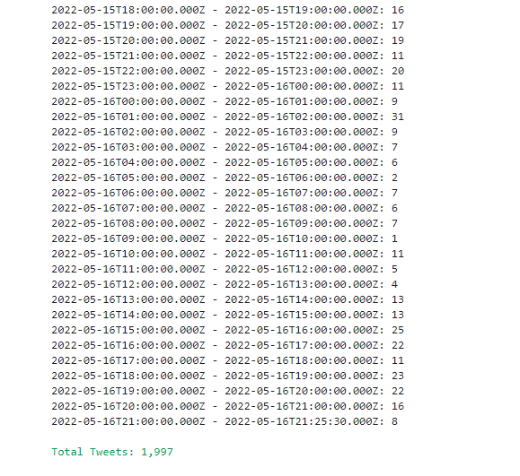

## The Twitter v.2 API

The Twitter API is what allows us to collect tweets. Twitter also keeps track 
of who is getting this data, and monitors data use--hence all that rigamarole to the
the API credentials.

We don't just go copy data out of Twitter's archive. We don't want that anyway. We want realtime
access to what is happening on Twitter, and we want to request only the information we need.

Recall that API is an acronym for Application Programming Interface. Typically, people are building
Tweeting robots (such as seismographs or weather forecasts) or looking to deliver content
on behalf of a commercial brand (or malicious actors--hence all the rigamarole to get the 
API keys). Those same API features allow us to do our research.
 
Compared to 
v1, the most recent version of the Twitter API (v2) includes additional levels of 
access, more features, and faster onboarding for developers and academic 
researchers.

The Twitter API comes along with all sorts of rules and regulations: how to 
submit requests, how many requests you can make in an hour, how many Tweets you 
can download in a month.

That last policy is something we should highlight. The level of API access 
you have is limited to 500,000 Tweets per month. For that reason, while we 
collect Tweets during this workshop, let's get in the habit of limiting ourselves 
to 500 Tweets.

~~~
!twarc2 timeline --limit 500 UCSBLibrary > 'raw_data/ucsblib_timeline.jsonl'
~~~
{. :language-python}

~~~
Set --limit of 500 reached:  15%|█▋         | 500/3271 [00:04<00:24, 113.41it/s]
~~~
{: .output}

So the above gives us, at most, 500 tweets from the UCSBLibrary Twitter 
account's timeline. And twarc tells us that it only gave us 15% of what is available.

You can always check to see how much of your quota you have used by visiting your 
[Twitter developer dashboard](https://developer.twitter.com/en/portal/dashboard)

> ## Academic access
> Academic access comes with 3 projects and 10 million tweets per month.
>
{: .callout}

## Twarc let’s you interact via the v1 api and v2 api.
We already did twarc2 timeline. Twarc1 timeline gives slightly different results 
(We need to confirm and figure out how they are different?). How are they 
different?

Remember: timeline captures tweets of 1 person: this harvests up to some 
arbitrary limit below 3200 You can request a specific time period for a person’s 
timeline: Dong dong dong (FIXME)

## Endpoints

The Twitter API (similarly to other API's) make requests for data and deliver 
data to you by calling an endpoint. An endpoint is a unique address that 
corresponds to specific types of information, and marks the limit (or endpoint) 
that an API may retrieve data from Twitter. The Twitter API include a range of 
endpoints, and they are categorized as:

* Accounts and users
* Tweets and replies
* Direct Messages
* Publisher tools and Software Development Kits

For this lesson, we will be covering some of your endpoint options that are 
available for to you as a user of the public Twitter v.2 API.  All these 
endpoints apply to the Tweets and Replies that satisfy a set of parameters you 
have set (e.g. Tweets from a certain account, Tweets containing a certain 
hashtag, etc). These endpoints indicate *how* we may retrieve Twitter data. 
Twarc2 give us easy access to these endpoints as commands.

| Endpoint            | Description |
|---------------------|-------------|
| Recent Tweet counts | Retrieve the count of Tweets posted in the last 7 days. |
| Recent Search       | Access to public Tweets posted in the last 7 days. |
| Filtered Stream     | Collect Tweets as they are posted in real-time. |

When you are doing exploratory searching, these are the order you want to do 
things in so that you don't waste your quota.


### twarc's Data

The data that is saved using Twarc is just what Twitter reads from a tweet as 
data and provides as data. So, keeping the data authentic for analysis is a 
design of Twarc. Twarc is also traceable, so people can see a log of how and when 
the data was collected.

In the v2 redesign, Twarc was also designed to be easily part of a pipeline of 
commands. Users can connect their data collecting to other pieces of their 
software that expect to get tweets as inputs. When you install Twarc, you will 
get two clients, twarc & twarc2. Twarc was designed with the v1 Twitter API in 
mind, and Twarc2 was designed as a response to Twitter implementing their v2 API.

### Tweet counts endpoint
 This endpoint allows you to fish around to estimate traffic without spending 
 your quota

~~~
!twarc2 counts --text "UCSB"
~~~
{: .bash}

Output: screenshot of the bottom of the output showing there were 1,997 mentions 
of UCSB on twitter in the 7 days before the command was run.



> ## Challenge: Try counting other things on Twitter
> Mentions of the words poker, golf, basketball, baseball, and football. Aggregate
> the counts together by day. Can we use these results to imagine what sports are
> most popular on Sports Twitter? Discuss.
>
> > ## Solution
> > ~~~
> > !twarc2 counts --granularity "day" --text "(Poker OR poker OR #Poker OR #poker)" 
> > !twarc2 counts --granularity "day" --text "(Golf OR golf OR #Golf OR #golf)" 
> > !twarc2 counts --granularity "day" --text "(Basketball OR basketball OR #Basketball OR #basketball)" 
> > !twarc2 counts --granularity "day" --text "(Baseball OR baseball OR #Baseball OR #baseball)" 
> > !twarc2 counts --granularity "day" --text "(Football OR football OR #Football OR #football)" `
> > ~~~
> > {: .language-python}
> > And their respective outputs:
> > ~~~
> > Total Tweets: 108,021
> > Total Tweets: 344,462
> > Total Tweets: 471,942
> > Total Tweets: 720,510
> > Total Tweets: 1,789,262
> > ~~~
> > {: .output}
> > From our output, football appears to be the most popular sport on Twitter currently, followed by baseball. 
> >
> {:solution}
{: .challenge}

## Filtered Stream
Filtering collects tweets as they happen in realtime. We will do a filtered
search later on. It's important to estimate how many tweets you
might get via a filtered stream before you start, so that you know
how long to run it.

## Recent Search
This endpoint gathers the most recent 6 days of a search string that
you pass to the API via twarc. Let's gather all the recent mentions of 
the UCSB Library. 

Both filter and search use 
<a href="https://twitter.com/search-advanced?lang=en" target="new">Twitter's advanced search syntax</a> 
We can use a little Boolean logic to make sure we cast 
a wide net, ie: that we search a variety of text strings and hashtags.

~~~
!twarc2 counts --granularity "day" 
        --text "(#UCSBLibrary OR UCSBLibrary OR 
                 ucsblibrary OR #ucsblibrary OR 
                 davidsonlibrary OR #davidsonlibrary)"
~~~
{: .source}

Is it worth doing the OR's? For sure. 
Twitter is NOT case sensitive.

~~~
!twarc2 counts --granularity "day" --text "(#UCSBLibrary OR UCSBLibrary)"`
~~~
{: .source}

## Big Data

### What's a lot?
Getting a sense of the scale of the conversation on Twitter is important. 
When you are starting out, you won't have much idea about how many tweets a 
search will return. With a monthly limit of 500,000 tweets, it's good to use
the Recent Tweet Counts endpoint to do some exploratory searching.

We got almost 100,000 kitten tweets. That's a healthy amount of data to analyze. We
also compared the numbers on Sports Twitter--second in size perhaps only to 
Politics Twitter. 

But just how big is Twitter? Try running these counts:

## What's a lot?

(FIXME) it looks like the -- below doesn't register as two separat - -. Which produces an error if you only have one. 

> ## Type along the following commands: 
> Let's try getting tweet counts for each of these common English words:
> - !twarc2 counts --text "dog" --granularity "day"
> - !twarc2 counts --text "cat" --granularity "day"
> - !twarc2 counts --text "amazon" --granularity "day"
> - !twarc2 counts --text "right" --granularity "day"
> - !twarc2 counts --text "good" --granularity "day"
> >
> > ## Solution
> > 
> > Their respective outputs are:
> > Total Tweets: 1,605,699
> > Total Tweets: 2,481,676
> > Total Tweets: 6,538,724
> > Total Tweets: 13,321,791
> > Total Tweets: 28,238,126
> >
> > You may notice that the word "good" is mentioned more than twice the amount of times that "right" is mentioned. 
> > {: .language-python}
> {:solution}
{: .challenge}


It looks like any English word that is used on Twitter more than 10 million
times a week on Twitter is a fairly non-specific search.

That should give us a pretty good idea that for research use, 500,000 tweets
is plenty to handle. And again: if you need more, there is a elevated level of
access for more high-powered academics.


## Pipeline: jsonl > head & tail > wc > csv > dataframe 
Just like we should keep track of how many tweets we download at any given time,
we should implement a standard workflow when gathering tweets. Generally for the
rest of this workshop, we will follow this workflow:

1. harvest json
1. flatten if necessary (when using timeline, etc.)
1. convert to csv
1. use wc to make you received as much as you expected
1. use head and tail to make sure you got the timespan you were expecting
1. use twarc utilities and twarc2 plug-ins
1. create a Pandas dataframe
1. use external utiities for further analysis

We've already discussed that While JSON is common, it's not super 
human-readable, and it can be difficult to convert to a dataframe (which most 
of us will want to do anyway). So twarc2 has an extension to turn our harvested 
jsonl to csv. csv's are always easily convertable into Pandas dataframes.

Timelines need to run through the `flatten` twarc plug-in.
We still haven't found another datatype that needs to be flattened. #FIXME ?

So let's flatten the UCSBLibrary timeline, count up our tweets,
convert to CSV, and create a dataframe

```
!twarc2 flatten raw_data/ucsblib_timeline.jsonl output_data/ucsblib_timeline_flat.jsonl
!twarc2 csv output_data/ucsblib_timeline_flat.jsonl output_data/ucsblib_timeline.csv
ucsblib_timeline_df = pandas.read_csv("output_data/ucsblib_timeline.csv")

```

Use `wc`: Did we get a reasonable amount? The api has a limit of 
3200, and we received 3226. Seems reasonable. 

Let's remind ourselves of all the different things that come
along with a tweet by printing out a list of the dataframe 
headers:

~~~
list(ucsblib__timeline_df.columns)
~~~
{: .language-python}

and see the column headers here as a list.

Easy 'analyses' using our dataframe:
Call each of these elements out of the dataframe by sorting:
- most retweeted
- most quoted
- tweeter with the most number of followers

~~~
Put in the relevant code here #FIXME
list(UCSB_df.columns)
~~~
{: .language-python}


# Final challenge

> ## Cats of Instagram
> Let's make a bigger datafile. Harvest 5000 tweets that use the hashtag "catsofinstagram"
> and put the dataset through the pipeline to answer the following questions:
> 
> 1. Did you get exactly 5000?
> 2. How far back in time did you get?
> 3. What is the most re-tweeted recent tweet on #catsofinstagram?
> 4. Which person has the most number of followers in your dataset? 
> 5. Is it really a person?
>
> > ## Solution
> > ~~~
> > !twarc2 search --limit 5000 "#catsofinstagram" source-data/catsofinstagram.jsonl
> > ~~~
> > 
> > 1. To check the number of tweets we collected, we can run the following.
> > ~~~
> > !wc -l 'catsofinstagram.jsonl'
> > ~~~
> > Which in our case, only returned 3. 
> > 
> > 2. Let's start by converting our dataset to a csv, then run some python 
> > ~~~ 
> >!twarc2 csv source-data/catofinstagram.jsonl > output-data/catofinstagram.csv
> > import pandas as pd
> > cat_df = pd.read_csv("output-data/catofinstagram.csv") 
> > list(cat_df.columns) #list the column name of cat_df 
> > print(cat_df['created_at'].head()) # Start time 
> > print(cat_df['created_at'].tail())# End time 
> > ~~~
> > (FIXME) I think there's an easier way to do this? Without converting to python?
> >
> > 3. We can do this by finding the max number of retweets in the dataset and then.
> > ~~~
> > cat_df[cat_df['public_metrics.retweet_count'] == cat_df['public_metrics.retweet_count'].max()].head()
> > ~~~
> > 4. 
> > ~~~
> > cat_df['author.public_metrics.followers_count'].max() #14574 followers
> > most_follower = cat_df[cat_df['author.public_metrics.followers_count'] == cat_df['author.public_metrics.followers_count'].max()].head()
> > ~~~
> > User with author_id 248757990 has the most followers, which is 14574.
> >
> > 5. 
> > ~~~
> > !twarc2 user id 248757990
> > ~~~
> > {:.solution}
{: .challenge}

