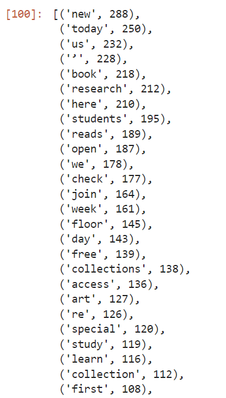
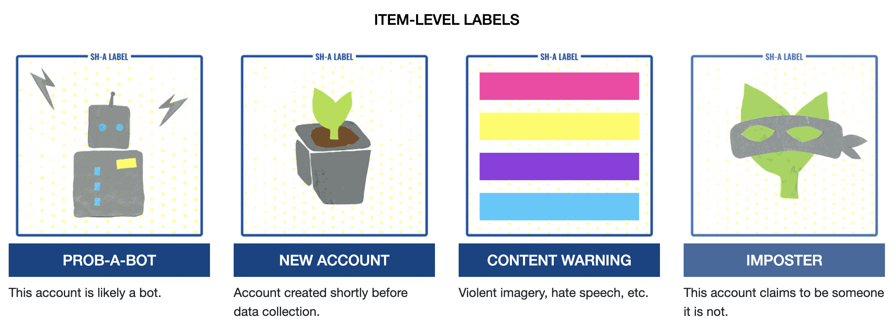

## Let's Get Ethical

There are multiple ethical issues to consider when using Twitter
data. In this lesson, we will be focusing on #FIXME issues: authorship, 
privacy, and consent. Ultimately, all three concern personhood.

## Authorship, the GDPR, and the Right to be Forgotten

Twitter users maintain ownership of their
tweets. As the author, users have both copyrights and
moral rights. (Only the former is defined in the United States.)

Copyrights prevent your tweets from being compiled together into a
publication for profit. That said, some authors do not
have any copyrights. For example, POTUS is an American government employee,
therefore that 'property' is in the Public Domain.

Laws vary greatly by country, so don't get American librarians started on
the Queen's copyrights over Canadian government data, which is complicated.

Moral rights are more complicated. Laws vary greatly by country--even moreso than
copyright. In the European Union, authorship includes the right to un-publish,
in other words, the right to be forgotten. Twitter, very cleverly, preserves this
right by letting us delete our tweets.

## Personally Identifiable Data
It's very easy to match up data to a human being. Conversely, it is very difficult
to remove something from the Internet once it is there. The European Union has created
the General Data Protection Regulation to protect people's identities as well as
to respect the privacy rights of "natural persons" (as distinct from public figures and
corporations).

The GDPR defines Personal Data as:

> ## What is Personal Data? 
> Personal data are any information which are related to an identified or identifiable 
> natural person.
>
> The data subjects are identifiable if they can be directly or indirectly identified, 
> especially by reference to an identifier such as a name, an identification number, location 
> data, an online identifier or one of several special characteristics, which expresses the 
> physical, physiological, genetic, mental, commercial, cultural or social identity of these 
> natural persons...
{: .callout}

> ## Discussion: Personal Data
>
> * Do you think that Twitter data should be treated as personal data?
> * What did you consider when making this judgment?
> * Are robots people?
> * Do the blue checkmark people deserve privacy?
> {: .source}
>
> > ## Considerations
> >
> > We get a lot of personal information when we gather tweets. We can 
> > often determine a user's approximate location, what they like, their beliefs, 
> > etc.
> > 
> > Even though some people treat Twitter like a diary, even though it is a public
> > space, researchers still need to respect their personhood.
> > {: .output}
> {: .solution}
{: .discussion}

As scholars, we also have an obligation to treat this information carefuly. Both
at the granular, individual level, and at the dataset level.

The first few minutes of [this standup comedy routine
shows the hazards of sharing too much personal information on social
media](https://www.youtube.com/watch?v=1qqo6z_aBzU)

# Protecting yourself

## Distance Reading
Researching tweets on Twitter may expose you to hate speech, and possibly disturbing imagery. 
Fortunately, when we work with thousands of tweets at a time, we do so at a distance,
so we can avoid consuming disturbing content directly.

The first step in distance reading is to get at the language--the actual tweets.

### Wordcounts with Textblob

Looking at the most commonly used words and phrases in a dataset is a text 
analysis practice. This helps us to get a sense of what we are dealing with in our 
dataset.

In Text Data Mining, a complete list of words and their frequency of appearance
can be called a 
"concordance." We would consider texts of the tweets themseves to be the corpus. 
Everything else is metadata.

We will use the TextBlob package for our full-text analyses, including getting
a word count. The most used words in your dataset can be used to judge the tone
of the overall content without needing to wade through thousands
of tweets.

Let's remind ourselves what dataframes we have available to work with:

~~~
# %who DataFrame
~~~
{: .language-python}
~~~
ecodatasci_df	 hashtag_gasprices_df	 hashtagcats_df	 
kittens_df	 library_timeline_df	 riots_dehydrated_df	 
ucsb_library_mentions_df
~~~
{: .output}

And let's remind ourselves which column we need
~~~
library_timeline_df.columns
~~~
{: .language-python}

~~~
hashtagcats_df['text'].head()
~~~
{: .language-python}

So that's the column to pull data into a python list:

~~~
list_tweets = hashtagcats_df['text'].tolist()
~~~
{: .language-python}

Next, we use the python `join` function to insert spaces between words and 
make this list into one long string of text.

~~~
string_tweets = ' '.join(list_tweets)
~~~
{: .language-python}

All this was to get our tweets into a string because TextBlob has its own data 
format, so we needed a string to pass to textblob. The function `TextBlob` converts the 
string of tweets to a textblob.

~~~
library_blob = TextBlob(string_tweets)
~~~
{: .language-python}

Now that we have our TextBlob, we can count and sort it. We do this using the 
python function `word_counts` and `sorted`.

~~~
library_freq = library_blob.word_counts
library_sorted_freq = sorted(library_freq.items(),
	key = lambda kv: kv[1], reverse = True)
print(library_sorted_freq)
~~~
{: .language-python}

This shows a lot of text with no meaning though. To help with this, we can get rid of
English stop words, like all the a's, and's, and the's. `nltk`, which got installed
along with textblob, has its own corpus of stopwords we can use:

~~~
# load the stopwords to use:
from nltk.corpus import stopwords

# sw_nltk is our dictionary of stopwords
sw_nltk = stopwords.words('english')
~~~
{: .language-python}

~~~
# create a new object without the stopwords
library_blob_stopped = textblob.TextBlob(library_words_stopped)
library_blob_stopped_freq = library_blob_stopped.word_counts
library_blob_stopped_sorted_freq = sorted(library_blob_stopped_freq.items(),
                             key = lambda kv: kv[1],
                             reverse = True)
library_blob_stopped_sorted_freq[1:50]
~~~
{: .language-python}

Lastly, we want to cut off the most used, which are http, ucsb, etc.
~~~
library_blob_stopped_sorted_freq[7:57]
~~~
{: .language-python}
~~~
[('new', 288),
 ('today', 250),
 ('us', 232),
 ('’', 228),
 ('book', 218),
 ('research', 212),
 ('here', 210),
 ('students', 195),
 ('reads', 189),
 ('open', 187),
 ('we', 178),
 ('check', 177),
 ('join', 164),
 ('week', 161),
 ('floor', 145),
 ('day', 143),
 ('free', 139),
 ('collections', 138),
 ('access', 136),
 ('art', 127),
 ...
~~~
{: .output}

Our results make sense. We can see that the words are associated with library-like
things. This text is worth some further examination.

If we were expecting hate speech, this is where we would start
to see it. If some of the top words are inflammatory, we can bet that the content of the 
whole datset will make some squeamish.

A more sophisticated text analysis would include passing this through 
another filter to remove the one and two letter words and the URL's. 

There are also functions to pull phrases
out of text corpuses, which is one form of what is called tokenization. 

# Disinformation
Twitter already removes a lot of violent and obscene content, but it does pride 
itself on being a free speech platform. Mainly, Twitter removes content that 
violates its Terms of Use. In some countries some content might be downright 
illegal and Twitter would be obliged to delete it or otherwise restrict access to 
it. Sometimes this means removing entire accounts, such as that of the former US 
President and many of his associates.

# Misinformation
Nature disinformation cloud 

Speaking of which, let's see how much data from January 6th, 2021
is still available.

> ## Challenge: January 6 Insurrectionists
>
> After the US Capitol riot, a user on kaggle captured 80,000
> Tweets from people associated with that day's events, concentrating
> on accounts from those protesting / rioting.
>
> This kaggle user, in the public interest, stored the full content of
> these Tweets as a .csv. The best practice would be to save only a
> dehydrated set of tweets. However, in this instance, we can use this
> person's conscientious objection to social norms and Twitter's
> Terms-of-Service to ask whether or not any of this is in the
> public good or an acceptable topic of research.
>
> Using the file [dehydrated_Capitol_Rioters.txt](../data/dehydratedCapitolRiotTweets.txt), 
> determine how many
> Tweets were in the archive, and how many remain on Mr. Musk's new
> acquisition.
>
> > ## Solution
> > When we first ran this, only a tiny fraction of the 
> > tweets remained. But more recently, we noticed that about 
> > 80% gets rehydrated. We suspect that Twitter has restored some
> > of this content.
> > 
> {: .solution}
{: .challenge}

### New Challenge???
That riot file is too big to work with on the fly.
We need something a bit different. First thought is to 
give a list of accounts and see who is still online?

Second thought: there's 58135 users in the rehydrated file. But they 
are mostly retweets. By getting out the users quoted, we can see that there's
many fewer original authors. How few? #FIXME

Chop the dataset to be the first 10,000 lines:

~~~
! head -n 10000 output_data/riots_flat.jsonl > output_data/riots10k.jsonl
! twarc2 csv output_data/riots10k.jsonl > output_data/riots10k.csv
~~~

Sort our 10,000 by account created date. New accounts can have a SH-A tag
applied to them.

# Social Humans and robots
Documenting the Now has released a classification scheme to apply
to Twitter accounts. We can apply these 
['Social Humans'](https://www.docnow.io/social-humans/)
labels to individual Tweets and/or accounts to identify bots,
trolls, and malicious actors.

Adding a column to our dataframe and classifying tweets according to what sort of 
entity we think posted them is a very useful flavor of analysis

~~~
code to add a column to the list of authors we pulled above?
~~~

