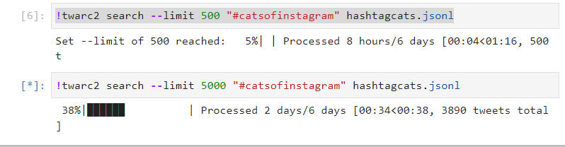
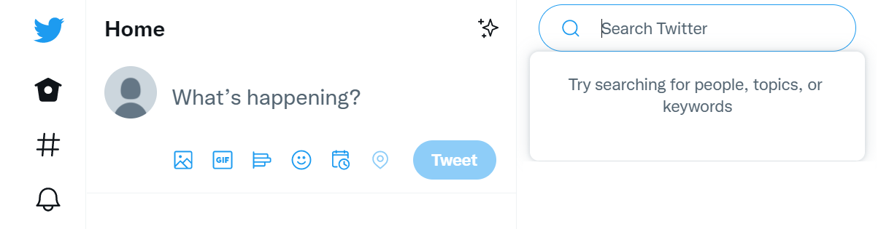
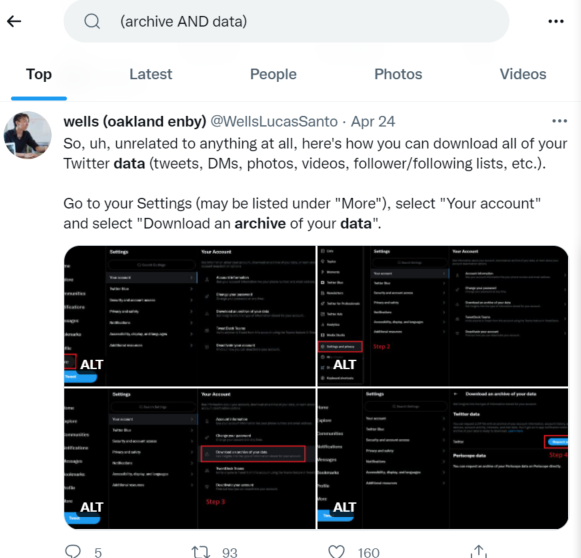
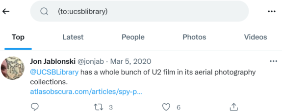

# Twarc Search Command

Returns tweets posted during the past 7 days that match a given query.

Let's make a new cell in our Notebook and run a search command. Remember that
we need to specify an output file. It is optional to use the `>` sign to signify the output file.

Earlier we searched for 500 posts for #catsofinstagram. Now let's look for 2000.

~~~
!twarc2 search --limit 2000 "(#catsofinstagram)" hashtag_cats.jsonl
~~~
{: .bash}

{: .image-with-shadow}
(FIXME need to change this picture to include 2000 limit, not 5000)

This command will search for any recent tweets that contain #catsofinstagram. Twarc tells me that I hit 
my limit of 2000 after checking back in after a few minutes.

We can use the visual indicator to confirm the limit of our second search. We may also open the file 
and see if we have something less than 2,000 tweets or 6 days worth. For this hashtag, you will
probably hit your limit.

If you want to go back as far in time as the Twitter API allows (6 days typically),
and NOT eat up too much of your monthly quota, 
you can simultaneously tighten up your search parameters and keep your `--limit` value low.
(FIXME: wasn't this the challenge from episode 4 asking for 500/5000 cats?)

~~~
!twarc2 search --limit 500 "(#catsofinstagram AND #cute)" > hashtag_cats_500.jsonl
~~~
{. :language-python}

This adjusted search returns 5 out of six days. So asking for 800 Tweets should get me six days' worth 
of results.

~~~
!twarc2 search --limit 800 "(#catsofinstagram AND #cute)" > hashtag_cats_800.jsonl
~~~
{: .language-python}

In this way we can 'sip' at our quota and make sure we can work within the 500,000 tweet limit.

## Twitter Search

The Twarc search command uses the same search syntax as the search bar on your [Twitter home page](https://twitter.com/home)

We will demonstrate some options you may use when searching tweets in both the Twitter search bar and 
through the Twarc search command. First, you may search tweets for content that contains certain words. 
In the example image below, we search for tweets that contain both the words "archive" and "data" by 
separating these words with a capitalized `AND`.

~~~
twarc2 search "(archive AND data)"
~~~
{: .language-bash}

To search for tweets that contain either word, and not require both words, the search may use a capitalized `OR` instead.

The Twitter search and Twarc search command also supports looking for tweets that mention a specified twitter account (mentioning another Twitter account in a tweet is known as "at-ing/ @-ing" or "tagging"). In the below example, Jon @-ed the Twitter account @ucsblibrary.

Note that capitalization for the account name does not affect the search.  Also, including the "@" symbol in front of the account name is not necessary, the search explicitly spells out the "to:" instead.

~~~
twarc2 search "(to:ucsblibrary)"
~~~
{: .language-bash}

As we have seen before, we may also search tweets that contain hastags. In the example below, notice that the resulting tweet also contains other hashtags that we did not explicitly search for.

~~~
twarc2 search "(#ecodatasci)"
~~~
{: .language-bash}

We have seen individual searches of each of these parameters. You may also combine these parameters to narrow down your results.

~~~
twarc2 search "(archive AND data) (#ecodatasci) (#ecodatasci)"
~~~
{. :language-bash}

> ## Challenge: Advanced Twarc Search
>
> What resulting tweet(s) do you get from using the Twarc search command?
> ~~~
> twarc2 search "(archive AND data) (#ecodatasci) (#ecodatasci)"
> ~~~
> {: .language-bash}
>
> Can you think of interesting search parameters for tweets?  If so, use Twitter search
> or Twarc search to try them out.
{: .challenge}

## Twarc Stream Command

You may also collect tweets as they are posted, and establish rules to what tweets will be collected (as you did for setting search parameters). To start with a stream, let's set some tweet parameters or rules:

~~~
!twarc2 stream-rules add "#catsofinstagram"
~~~
{: .language-python}

~~~
🚀  Added rule for "#catsofinstagram"
~~~
{: .output}

~~~
!twarc2 stream-rules add "fluffy"
~~~
{: .language-python}

~~~
🚀  Added rule for "fluffy"
~~~
{: .output}

To see what your current stream rules are, you may list them:

~~~
!twarc2 stream-rules list
~~~
{: .language-python}

~~~
☑  #catsofinstagram
☑  fluffy
~~~
{: .output}

You may stream tweets that contain words and hashtags like we had done in Twarc search. We cannot use a username to stream tweets that mention another Twitter account:

~~~
!twarc2 stream-rules add "at:_We_Rate_Cats"
~~~
{: .language-python}

~~~
💣  UnprocessableEntity see: https://api.twitter.com/2/problems/invalid-rules
~~~
{: .output}

When you start collecting tweets with the rules you have set in place, you must create the file that the data will be stored in:

~~~
!twarc2 stream > "raw_data/streamed_tweets.jsonl"
~~~
{: .language-python}

Once this command is run, you will collect tweets that match the rules set in place.

This collection will be ongoing unless you explicitly shut down the stream with `ctrl + c`. While this stops the stream collection, it does not remove the stream-rules. In order to remove the rules you had set in place, you must use delete:

~~~
!twarc2 stream-rules delete ""#catsofinstagram"
!twarc2 stream-rules delete "fluffy"
~~~
{: .language-python}

> ## Discuss: Search vs Stream
> We had an introductory look at the use of the search command and the stream command.
> Please brainstorm what the difference(s) are between searching tweets and streaming tweets.
> When might you choose stream over search? How can you use them together?
{: .discussion}

Here is more [clarification](https://scholarslab.github.io/learn-twarc/06-twarc-command-basics).

Functions and utilities: refer to our guide and readthedocs.docnow. There will be more detail in episode 6.
Functions / extensions: can be pip installed --and these installs stick in our Labs environment (because we
have permission to install things on top of twarc)

Our twitter guide gives advice about how to follow a real-time event, like pending #scotus decisions.
