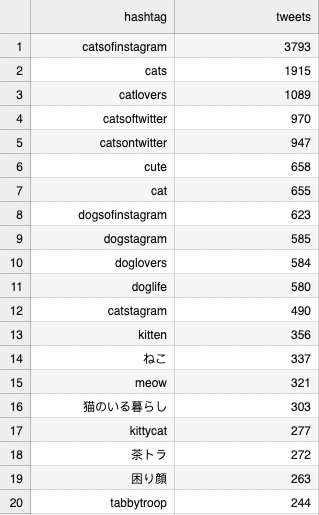
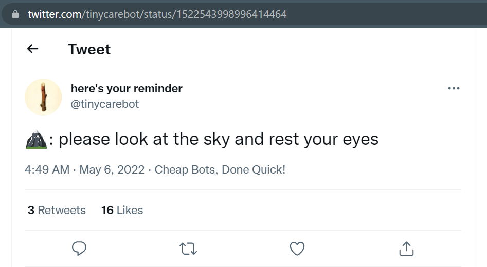

## When we have thousands of tweets: we need analysis tools

twarc2 plug-ins like csv need to be installed separately. 
In this episode, we will look at twarc-hashtags and twarc-network

A few [more twarc2 plugins](https://twarc-project.readthedocs.io/en/latest/plugins/)
are available.

First you need to `pip install` in BASH

`!pip install twarc-hashtags`
`!pip install twarc-network`

~~~
!pip install twarc-hashtags
~~~
{: .language-bash}

When we run hashtags on our `hashtagcats` dataset, we should see the hashtag 
we search for first. Our other results make sense as well. We see a lot of dogs and Japanese 
cropping up. In case you didn't know it, Internet cats are huge in Japan.

> ## Most seen hashtags
> 
> ~~~
> !twarc2 network raw_data/hashtagcats.jsonl output_data/hashtagcats_network.html
> ~~~
> {: .source}
>
> > ## Top hashtags
> > 

# Challenge: look for surprising and anticipated hashtags
in a couple of other datasets that we have.

## Interpreting the network results

> !twarc2 network raw_data/hashtagcats.jsonl output_data/hashtagcats_network.html

The built-in web viewer ain't so hot, so download that html file to view the network on 
your own computer. Chrome works fine, and it's best to make the diagram
fullscreen. We can see:
- the largest central cluster around the account @catsofinstagram
- a corporate entity (litter box stuff) shows up, and that a big sub-network exists 
- neighborhoods of users, such as those around kiko1123215 in the
  image below. Kiko is nearby, but separate from, the 
  @catsofinstagram twitter account.

[portion of a network diagram with a central node kiko11232015 off to the
side of the main cluster of the account @catsofinstagram](../fig/cat_network.png)

(FIXME) If we can find someone (such as @tinycarebot) who
tweets alot, we can see who they are
@-ing on their timeline. OR: see @'s as part of a search/stream

# Retweets

We may get data on the retweets of one or more tweets. Recall that a retweet is when a 
Twitter account shares the Tweet of a different Twitter account.

This tweet has three retweets. We are able to compile data on the Twitter accounts that 
have retweeted the above tweet. 

Another way we can gather data on the user accounts of the retweeters is by using a 
twarc2 command. First, we will need to get the tweet's numeric identifier. One way we 
can get a tweet's ID is by looking at the url of the tweet. In this case, the tweet's ID 
is 1522543998996414464.

~~~
!twarc2 retweeted-by 1522543998996414464 > 'raw_data/tinycarebot_rtby.jsonl'
~~~
{: .language-bash}

## Tweets vs. retweets

Looking at just about any dataset of tweets, you will see a LOT of retweets.

We can run a Tweets vs. retweets 

(as a graph?)

(FIXME) Originals vs. retweets is such a good metric to have, we
should add it to our workflow:

(FIXME)
1. test search Twitter
1. download data
1. flatten in necessary
- wc: see how many you got
- csv: to make it readable
- determine date range
- Originals vs. retweets

## Followers

(FIXME) Even 5 takes a long time to run. We could try to expand on
~~~
!twarc2 followers --limit 5 tinycarebot >  'raw_data/tcb_followers.jsonl'
~~~
{: .language-bash}

### twarc1 utilities
we may ditch these

Back in Episode 1, we mentioned something referred to as
'utilities'. Now, we'll take a closer look at what those
utilities are, how you use them, and why they are important to
our Twitter data analysis and exploration.

It's important to note that there are two sets of
utilities: those that came from the first iteration of twarc (files in the "utils" folder), and those that get pip installed on top
of twarc2.

The utilities from the first release of twarc, which we'll simply refer to as "twarc 1", are python files that we uploaded as part
of setup. They should now be in your "utils" folder. These utilities provide useful data-processing tools that we can use on Twitter data that have been harvested using twarc2 commands.

## Utilities: emojis

The first utility from twarc1 reads emojis. You will need to pip install this utility into the notebook before we may use it.

~~~
!pip install emoji
~~~
{: .language-bash}

~~~
import emoji
print(emoji.emojize('Hello :globe_showing_Europe-Africa:!'))
~~~
{: .language-python}

~~~
Hello 🌎!
~~~
{: .output}

While we only need to pip install emoji into our environment once, you will need to import whenever you open a new notebook.
We can use emojis to get a count of emojis from a set of tweets, and these results are kept in a text file.

~~~
!python 'utils/emojis.py' 'raw_data/CapitolRiotTweets_hydrated.jsonl' > 'output_data/capitol_emotes.txt'
~~~
{: .language-bash}

Note: the language for using this is BASH, not python. The emojis is python-based, but is intended to be ran as a BASH command.

> ## Challenge: Comparing hashtags
> Sometimes you can tell the overall "emotional tone" of a dataset
> by looking at its most used emojis. Do we think that taxday
> or kittens are going to have more positive emojis?
>
> > ## Solution
> > We may use emojis on both data gathered with twarc1 and twarc2.
> > ~~~
> > !python 'utils/emojis.py' 'raw_data/taxday.jsonl' > 'output_data/taxday_emotes.txt'
> > ~~~
> > {: .language-bash}
> >
> > ~~~
> > #catsofinstagram was harvested with the twarc2 command, timeline
> > (FIXME)
> > ~~~
> > {: .language-bash}
> >
> {: .solution}
{: .challenge}

# Utilities: wall

(FIXME) What wall command does

The wall command create a wall of tweets in a reader-friendly html page. It contains all of the tweets you harvested in the jsonl files.

(FIXME) Why we need to flatten

~~~
!twarc2 flatten 'raw_data/CapitolRiotTweets_hydrated.jsonl' > 'output_data/capitol_flat.jsonl'
~~~
{: .language-bash}

~~~
!python 'utils/wall.py' 'output_data/capitol_flat.jsonl' > 'output_data/capitol_wall.jsonl'
~~~
{: .language-bash}

Then run the following command to extract all hashtags from capitol_flat.jsonl
~~~
!twarc2 hashtags 'output_data/capitol_flat.jsonl' > 'output_data/capital_hashtags.csv'
~~~
{: .language-bash}

By using the twarc1 utility, `retweets`, we can gather 
this information in a line-oriented json file.

~~~
#!python 'utils/retweets.py' ...
(FIXME)
~~~
{: language-bash}

