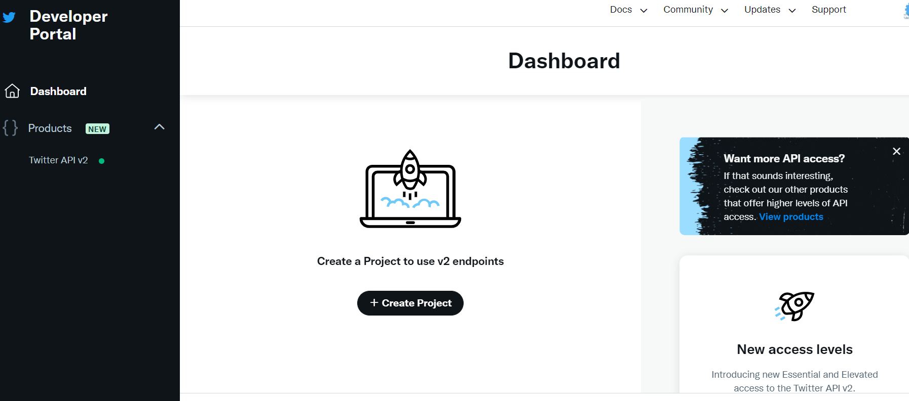
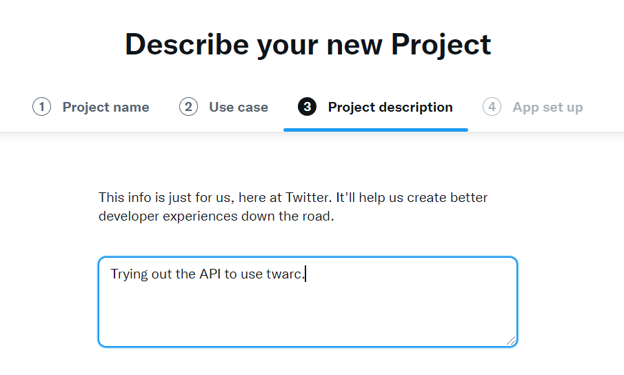
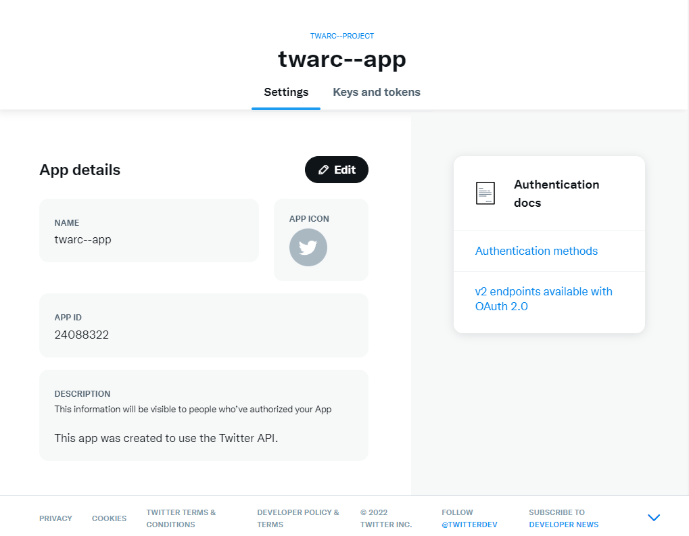
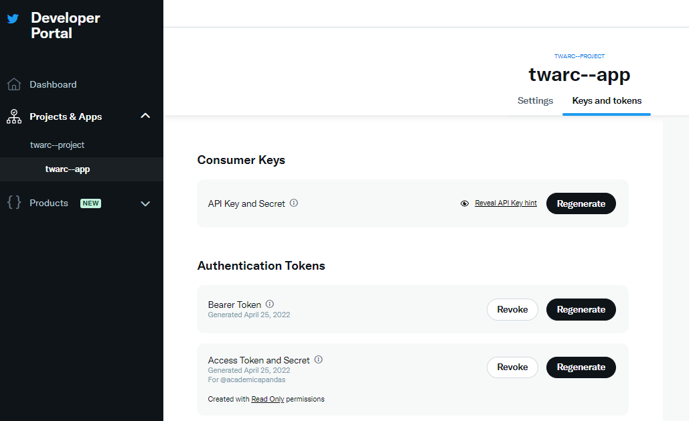
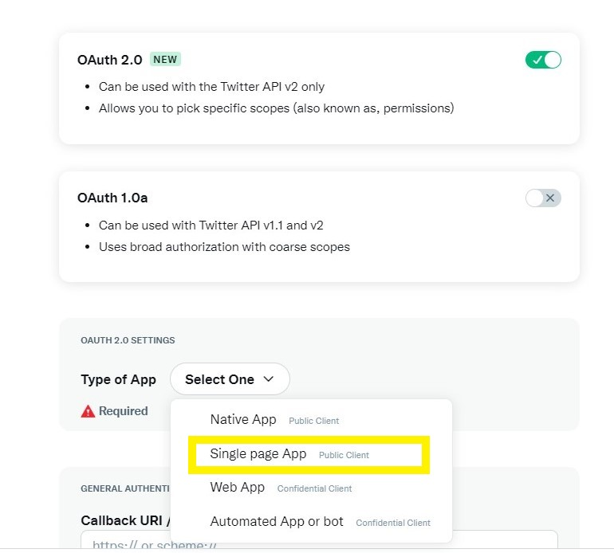

> ## Data
>
> The data we will be using in the workshop is to practice hydrating twitter data. Please down the data file `taxday.jsonl` and keep it in an accessible place (such as your desktop).
> On April 15, 2022, we used twarc to search for all mentions of the hashtag `#taxday` and created this file (April 15th is the deadline for Americans to file their annual income report).
> [taxday data download link](https://github.com/UCSBCarpentry/twitter-with-twarc/raw/gh-pages/data/taxday.jsonl)
>
{: .prereq}

### Getting the Necessary Privileges

Generally, we would call this 'getting your API key', but like many API's, the process of getting access to Twitter's has
become a complicated process. These instructions should create a new developer account with *Essential Access* privileges.

To get started, you will need:
* #### [A Twitter Account](https://twitter.com/):
Valid email account and cell phone number to receive texts are necessary.
* #### [Developer Account](https://developer.twitter.com/en):
You must create the Twitter account first, in order to link to the Developer account.

Getting developer access requires you to validate yourself as a human, so the
form is particular about having a valid phone number and email address added to your Twitter account. This is so Twitter can authenticate a user.

Once you are logged on to Twitter, go to 
the [Developer Portal sign-up page](https://developer.twitter.com/en/portal/petition/use-case)

Fill out the application questions as listed here:
  
  - What Country are you based in?
  - What's your use case? Choose `Doing academic research` (recommended)
  - Will you make Twitter content or derived information available to a government entity or a government affiliated entity? `No` (recommended)
  - Click through the user agreement and verify your email.

### Making your Project and App

Right after verifying your email, you will be taken to your Developer Portal Dashboard and 
prompted to create a new *Project*. Every instance of Twarc is a *Twitter App* and 
Twitter Apps live inside of *Projects*. After selecting 'Exploring the API' as your use 
case, you will be given "Essential Access". Essential Access allows you to have one 
project with one App inside of it.

<!---

--->

### Acquiring Keys and Tokens

After you have completed setting up your project, you will see the App details below. You can edit the name and app icon if you'd like to personalize it.

Under the project name, you will see *Settings* and *Keys and Tokens* tab. You will need to navigate to *Keys and Tokens* to generate your 5 keys and tokens. 
You will need to click the _generate_ button to get each of your keys and tokens. They are not automatically made for you so you must generate them the first time.

If you forget to save, or lose your tokens, you can click _regenerate_ to regenerate your keys and tokens, a new set is made for you.

> ## Necessary Keys and Tokens
>
> _*SAVE*_ these keys in an accessible place like a password manager or in a document. You will not see these 
> keys again, so this is essential. You should have: 
>
> * API Key 
> * API Secret 
> * Authentication Bearer Token 
> * Access Token
> * Access Token Secret
>
> You will have succeeded when you have these 5 keys and tokens
{: .prereq}

<!--

### User Authentication Settings

After generating your tokens and keys, you need to authenticate to use the API. This can be found under Projects & Apps > Project > App.
Navigate to the User Authentication set up in the Settings Page and complete the following:
- Turn on OAuth 2.0
- Type of App: Single Page App
- Callback URL/Redirect URL: https://127.0.01/
- Website URL: https://ucsbcarpentry.github.io/

Save OAuth 2.0 Client ID and Client Secret

-->


